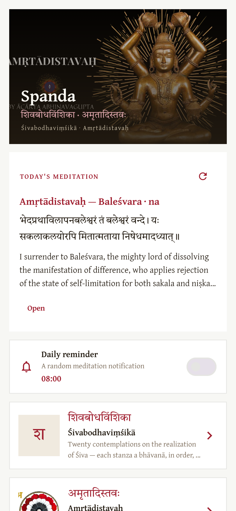
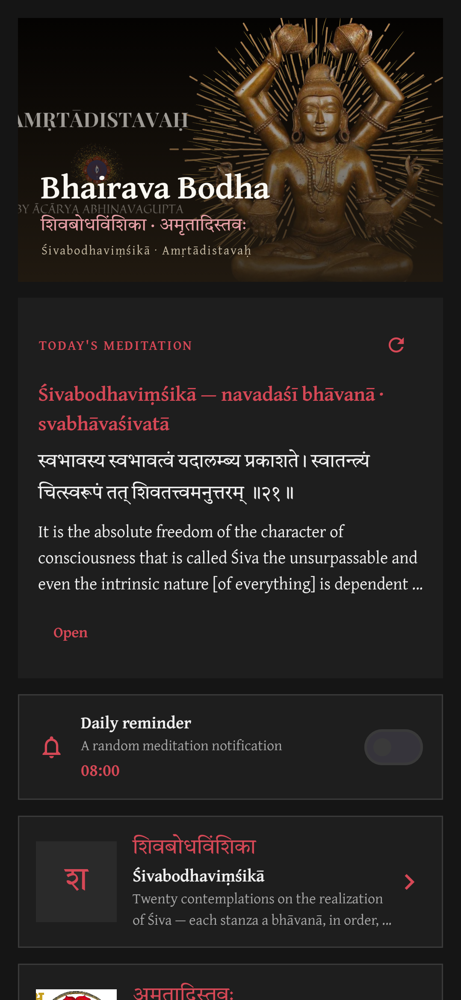
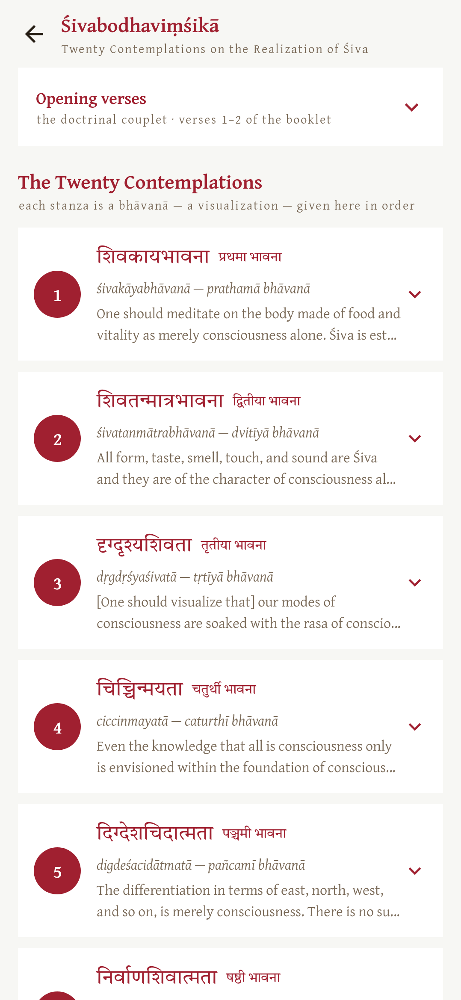
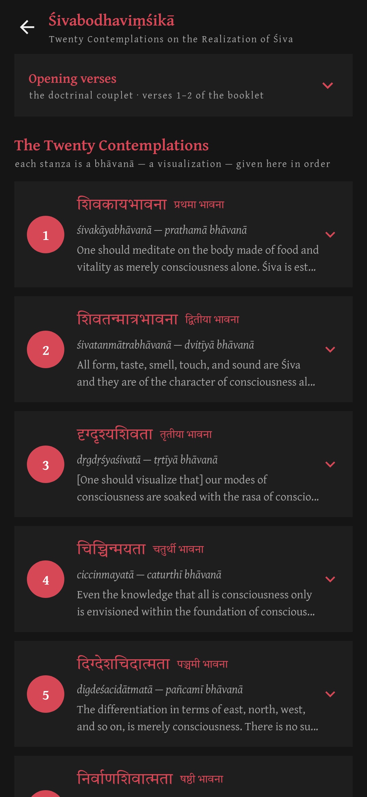
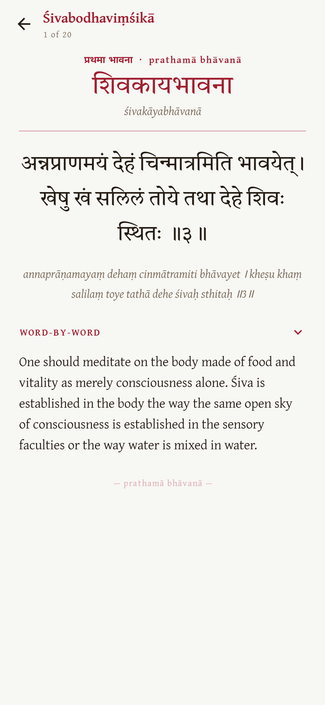
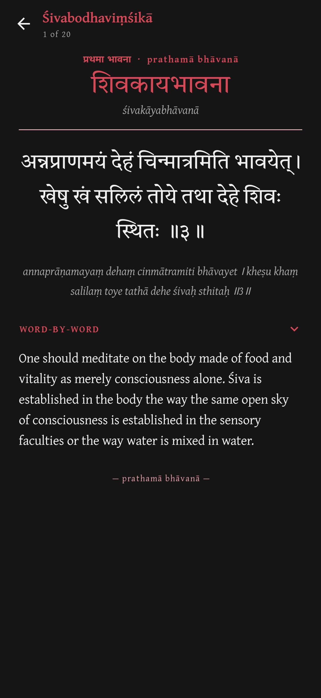
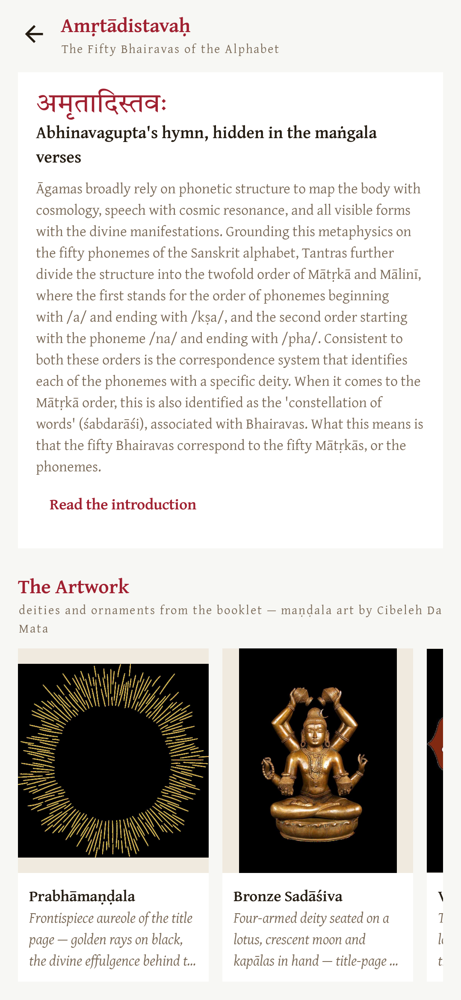
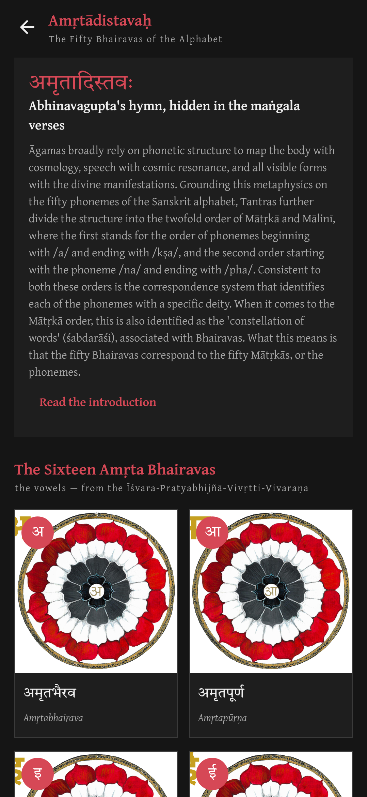
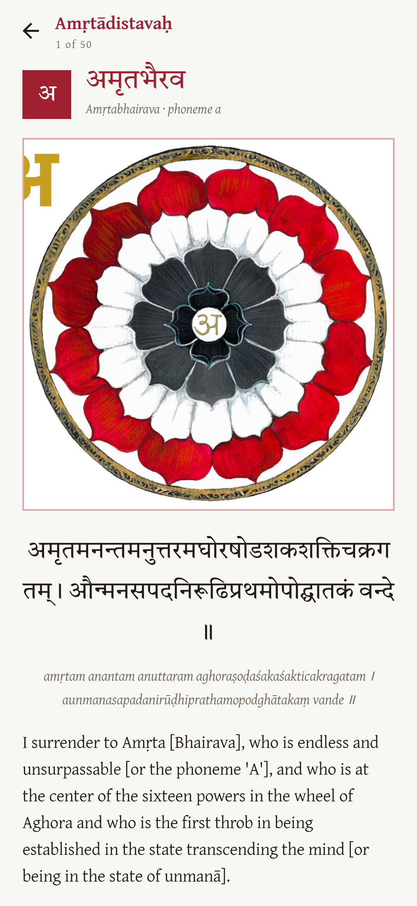
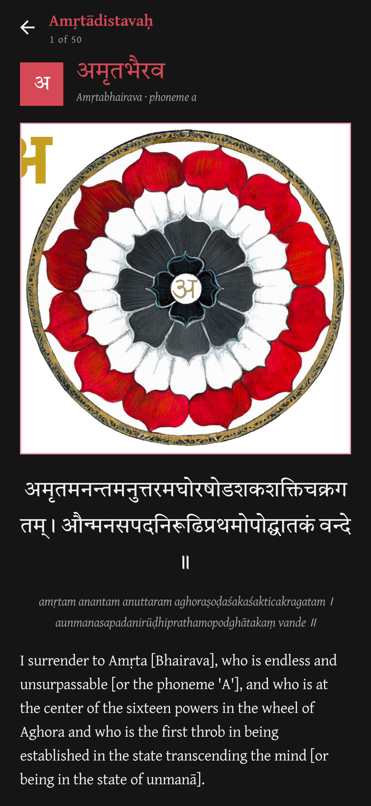

# Spanda — Śivabodhaviṃśikā · Amṛtādistavaḥ

A personal Android app for two texts translated by **Śaivācārya Sthaneshwar Timalsina**
(Vimarsha Foundation, San Diego, 2021):

> **Not affiliated with, endorsed by, or sponsored by Vimarsha Foundation or Boris Marjanović.**
> This is an unofficial, personal project built for my own study of these texts.
> The Śivabodhaviṃśikā/Amṛtādistavaḥ translations and maṇḍala art are © Vimarsha Foundation (San Diego, 2021);
> the Gītārtha-saṅgraha translation is © Boris Marjanović / Indica Books (2004);
> all included here for personal study only, not redistributed commercially.
> Consider supporting Vimarsha Foundation: <https://www.vimarshafoundation.org/supportus>

1. **Śivabodhaviṃśikā** — *Twenty Stanzas on the Realization of Śiva*.
   The 20 contemplations (bhāvanās), in order, each with Devanagari,
   transliteration, a word-by-word gloss, and translation.
2. **Amṛtādistavaḥ** — Abhinavagupta's hidden hymn to the **50 Bhairavas**
   of the alphabet (16 vowels + 34 consonants), each with its maṇḍala
   art (from the Vimarsha Foundation booklet), Devanagari, transliteration,
   and translation.

For personal study only. All text and art © Vimarsha Foundation, used here
privately, not redistributed.

## Features

- **Śivabodha reader** — 20 contemplations in order; swipe between stanzas;
  expandable word-by-word gloss per stanza.
- **Amṛtādi gallery** — all 50 Bhairavas with their maṇḍalas; swipe between them.
- **Daily reminder** — a random meditation notification each day
  (configurable time, enable/disable). Tapping it opens the exact stanza/bhairava.
- **Today's meditation** — a random verse on the home screen, reshuffle anytime.
- **Light & dark themes** — follows the system setting; neutral near-white background
  with medium-dark red accents and sharp square corners. Tiro Devanagari Sanskrit
  & Gentium Plus type.

## Screenshots

| Light | Dark |
|---|---|
|  |  |
|  |  |
|  |  |
|  |  |
|  |  |

Screenshots are rendered by Roborazzi (see `ScreenshotTest.kt`); regenerate with:

```bash
./gradlew testDebugUnitTest --tests "com.madhav.bhairava.ScreenshotTest" -Proborazzi.test.record=true
```

## Build

Requires JDK 17 and Android SDK (compileSdk 34).

```bash
# from this directory:
./gradlew assembleDebug
# APK at app/build/outputs/apk/debug/app-debug.apk
# install:
adb install -r app/build/outputs/apk/debug/app-debug.apk
```

Or open the folder in Android Studio and press Run.

## Data

- `app/src/main/assets/sivabodha.json` — the 20 contemplations (+ the 2 opening
  verses). Note: in the printed booklet the doctrinal couplet is verses 1–2;
  bhāvanā *n* is printed verse *n+2* (markers ॥३॥–॥२२॥ preserved as printed).
- `app/src/main/assets/amrta.json` — the 50 Bhairavas (16 vowels = Amṛta
  Bhairavas, 34 consonants = Rudras), plus Timalsina's introduction and the
  Mālinīvijayottara III.17–24 source list.
- `app/src/main/assets/mandala_01.jpg … mandala_50.jpg` — maṇḍala art
  extracted from the booklet (rendered from the PDF at 1.8×, JPEG q82).
- `app/src/main/assets/cover.jpg`, `frontispiece.jpg` — booklet artwork.

## Project layout

```
app/src/main/java/com/madhav/bhairava/
  MainActivity.kt            deep-link entry from notifications
  data/                      models + JSON repository
  notify/                    WorkManager daily reminder
  ui/                        Compose screens (home, lists, pager readers)
  ui/theme/                  light/dark theme, Devanagari serif fonts
```
